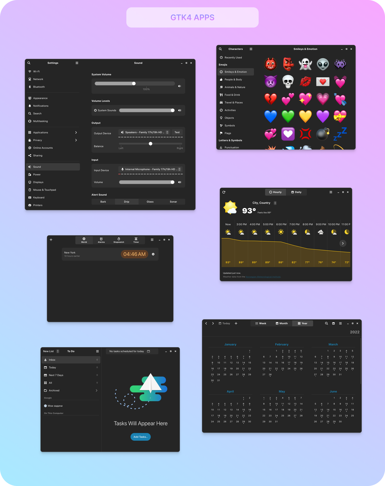
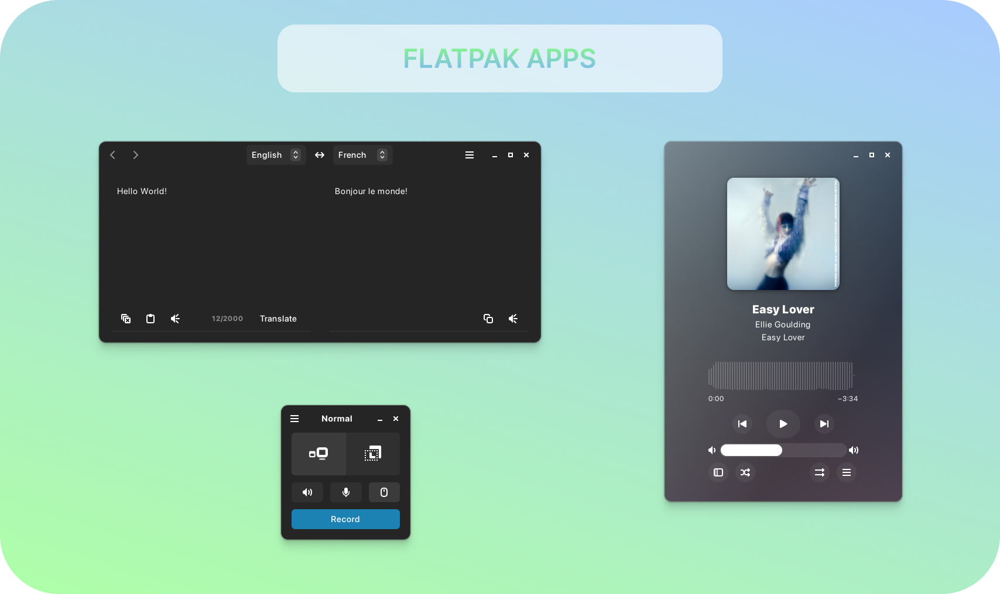
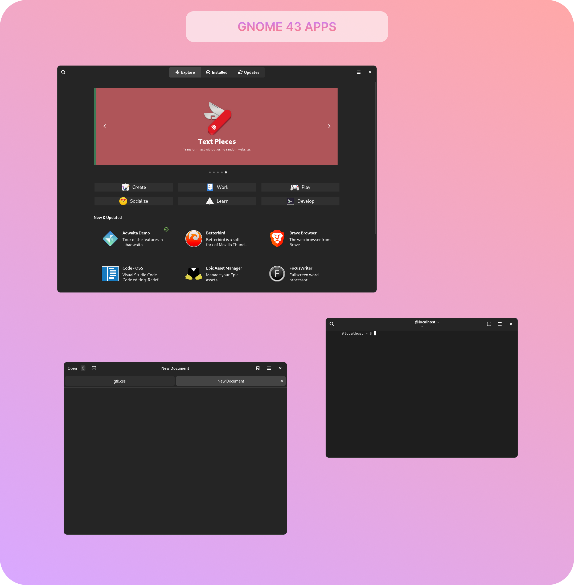
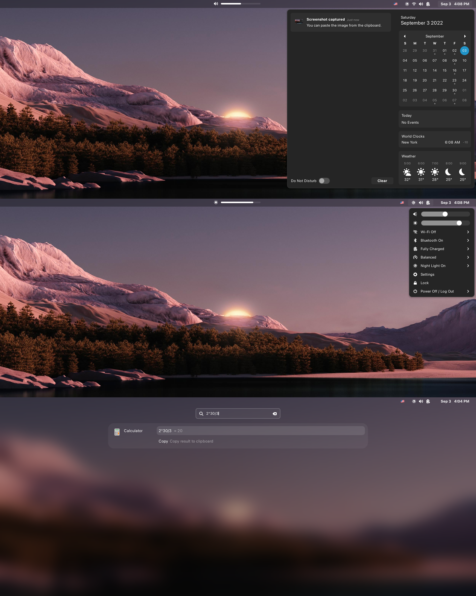

# Mono Theme for Gnome
Simple theme with nothing extra to use on a regular basis.  
Theme tested on Manjaro Linux and Fedora with Wayland.

<p align="center"><b>Gtk4 apps</b></p>
<p align="center">
  
</p>

<p align="center"><b>Flatpak apps</b></p>
<p align="center">
  
</p>

<p align="center"><b>Gnome 43 apps</b></p>
<p align="center">
  
</p>

<p align="center"><b>Gnome-shell</b></p>
<p align="center">
  
</p>

## Support
[My Patreon](https://www.patreon.com/witalihirsch)

## Download
Download theme [here.](https://github.com/witalihirsch/Mono-gtk-theme/releases)

## Installation
Currently only dark theme is available for Gtk4. Light theme and theme for Gtk3 coming soon.

### GTK4
To install the Gtk4 theme move the contents of `gtk4.0` to `home/user/.config/gtk4.0`.

### Flatpak
To install themes on Flatpak apps use these commands:  
```sudo flatpak override --filesystem=$HOME/.themes```  
```sudo flatpak override --env=GTK_THEME=MonoTheme``` - theme name

### Gnome-shell
To install the gnome-shell theme, move the entire theme folder to `/home/user/.themes` and select gnome-shell theme in Gnome Tweaks.  
Important!  
If you want the gnome-shell theme to extend to the lock and login screen, move the `gnome-shell-theme.gresource` file to `/usr/share/gnome-shell/` with a replacement and restart system with `ALT+F2` and enter `r` or reboot system (I recommend saving the source file from the folder to a safe place beforehand, if will need to be returned).
Example: ```sudo cp gnome-shell-theme.gresource /usr/share/gnome-shell```


